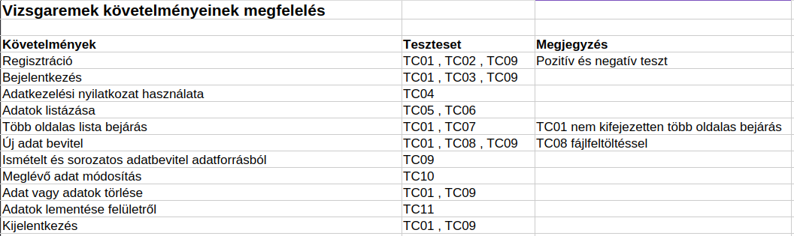

# Manuális tesztesetek dokumentációja

## Cél

A dokumentum tartalmazza azokat a manuális teszteseteket,
amelyek alapján az automatizált Selenium tesztek elkészültek.

Az alábbiakban részletesen, a vizsgaremek követelményeihez igazítva összegyűjtöttem a lépéseket és a teszteseteket a Practice Software Testing - Toolshop ([https://practicesoftwaretesting.com/](https://practicesoftwaretesting.com/)) webalkalmazáshoz, amely minden kötelező funkciót lefed.

## Összefoglaló táblázat

## TC01 Regisztráció

Teszt rövid leírása: Új felhasználói fiók sikeres létrehozása.

Teszt lépések:

Navigáció a [https://practicesoftwaretesting.com/](https://practicesoftwaretesting.com/) weboldalra.

Kattintás a jobb felső sarokban található hamburger ikonra aztán a "Sign in" linkre, majd a regisztrációs opció kiválasztása az alul lévő "Register your account" gomb segítségével.

A regisztrációs űrlap kitöltése random adatokkal:

- Keresztnév és vezetéknév (First name, Last name)
- Születési dátum (Date of birth)
- Cím adatok (Country, Postal code, House number, Street, City, State)
- Telefonszám (Phone)
- Email cím (Email) és jelszó (Password)
- Jelszó követelmények: Minimum 8 karakter, kicsi és nagy betű is kötelező, legalább egy szám, legalább egy speciális karakter 
(@, #, $, stb.)

A "Register" gombra kattintás.

A rendszer sikeresen regisztrálja a felhasználót, és átirányít a bejelentkezési oldalra.

Bejelentkezünk az oldalra az újonnan regisztrált email címmel és jelszóval.

Utána admin felhasználóval töröljük az újonnan létrehozott fiókot.

Elvárt eredmény: A sikeres bejelentkezés után megjelenik az üdvözlő üzenet, melynek ez a tartalma: 
"Here you can manage your profile, favorites and orders."

## TC02 Regisztráció

Teszt rövid leírása: Új felhasználói fiók sikertelen létrehozása.

Teszt lépések:

Navigáció a [https://practicesoftwaretesting.com/](https://practicesoftwaretesting.com/) weboldalra.

Kattintás a jobb felső sarokban található hamburger ikonra aztán a "Sign in" linkre, majd a regisztrációs opció kiválasztása az alul lévő "Register your account" gomb segítségével.

Keresztnév mezőt direkt üresen hagyjuk (First name)

A regisztrációs űrlap kitöltése random adatokkal kivéve a keresztnév mezőt:

- Vezetéknév (Last name)
- Születési dátum (Date of birth)
- Cím adatok (Country, Postal code, House number, Street, City, State)
- Telefonszám (Phone)
- Email cím (Email) és jelszó (Password)
- Jelszó követelmények: Minimum 8 karakter, kicsi és nagy betű is kötelező, legalább egy szám, legalább egy speciális karakter 
(@, #, $, stb.)

A "Register" gombra kattintás.

A rendszer kiírja, hogy sikertelen a regisztráció.

Elvárt eredmény: Sikertelen a regisztráció és a keresztnév alatt megjelenik egy hibaüzenet: 
"First name is required"

## TC03 Bejelentkezés

Teszt rövid leírása: A regisztrált fiókkal való sikeres belépés.

Teszt lépések:

Navigáció a [https://practicesoftwaretesting.com/](https://practicesoftwaretesting.com/) weboldalra.

Kattintás a jobb felső sarokban található hamburger ikonra aztán a "Sign in" linkre.

Az email cím és a jelszó megadása az "Email address" és a "Password" mezőkben.
A teszt felhasználó adatai a gyökér könyvtárban lévő .env fájlban találhatóak.

A "Login" gombra kattintás.

Elvárt eredmény: A felhasználó sikeresen belép, felül a hamburger ikonra kattintás után megjelenik a felhasználó teljes neve.

## TC04 Adatkezelési nyilatkozat használata

Teszt rövid leírása: Az adatvédelmi / ÁSZF / jogi nyilatkozat elérhetőségének és tartalmának validálása.

Teszt lépések:

Navigáció a [https://practicesoftwaretesting.com/](https://practicesoftwaretesting.com/) weboldalra.

Az oldal láblécében (footer) található "Privacy Policy" gombra kattintás.

Megjelenik az adatvédelmi nyilatkozat, melynek a tartalmát ellenőrizzük, hogy megtalálhatóak-e benne a kulcsszavak: "Data Removal", "Data Security"

Elvárt eredmény: Az adatkezelési nyilatkozat oldala hibátlanul betöltődik, és a kötelező jogi szöveg megjelenik a felületen ("Data Removal", "Data Security").

## TC05 Adatok listázása

Teszt rövid leírása: A termékek vagy elemek listájának megjelenítése a felületen.

Teszt lépések:

Navigáció a [https://practicesoftwaretesting.com/](https://practicesoftwaretesting.com/) weboldalra.

A termék kártyák betöltődésének megvárása.

Elemek darabszámának ellenőrzése. (9 db)

Elvárt eredmény: A termékek listája hiba nélkül betöltődik, és a tételek láthatóvá válnak a felhasználó számára.

## TC06 Termékek nevének meglétének ellenőrzése

Teszt rövid leírása: A megjelenő terméklistában ellenőrizzük, hogy az elvárt termékek megtalálhatóak-e.

Teszt lépések:

Navigáció a [https://practicesoftwaretesting.com/](https://practicesoftwaretesting.com/) weboldalra.

A termék kártyák betöltődésének megvárása.

A terméknevek lekérése a felületről.

Az elvárt terméknevek ellenőrzése a listában:
   - Combination Pliers
   - Pliers
   - Bolt Cutters
   - Long Nose Pliers
   - Slip Joint Pliers
   - Claw Hammer with Shock Reduction Grip
   - Hammer
   - Claw Hammer
   - Thor Hammer

Elvárt eredmény:
A terméklista tartalmazza az összes elvárt terméket, és azok nevei megfelelően megjelennek a felhasználói felületen.

## TC07 Több oldalas lista bejárása

Teszt rövid leírása: A kategóriák menüben ehhez a négy típushoz megjelennek a termékek 
az oldalon (Hand Tools, Power Tools, Other, Special Tools).

Teszt lépések:

Navigáció a [https://practicesoftwaretesting.com/](https://practicesoftwaretesting.com/) weboldalra.

A "Categories" menüpontra kattintás, utána a  kategória "Hand Tools" kiválasztása és ellenőrzése, hogy legalább egy elem megjelenik, utána a másik három kategória ellenőrzése
"Power Tools", "Other", "Special Tools" 

Elvárt eredmény: A "Hand Tools", "Power Tools", "Other" kategóriáknál megjelenik legalább egy elem.
A "Special Tools" kategóriánál, csak ez a szöveg jelenik meg "There are no products found."

## TC08 Új adat bevitel

Teszt rövid leírása: Új kapcsolati adat rögzítése.

Teszt lépések:

Navigáció a [https://practicesoftwaretesting.com/](https://practicesoftwaretesting.com/) weboldalra.

Navigáció a Kapcsolat (Contact) menüpontra vagy egy adatbeviteli űrlapra.

Az űrlap mezőinek kitöltése adatokkal (Név, Tárgy, Üzenet).

A "Send" vagy "Submit" gombra kattintás.

Elvárt eredmény: A rendszer elfogadja az adatokat, és egy sikeres üzenetet jelenít meg a felületen.

## TC09 Ismételt és sorozatos adatbevitel adatforrásból

Teszt rövid leírása: Több felhasználó regisztrációja, bejelentkezése és kijelentkezése külső adatforrásból (CSV) beolvasott adatok alapján.

Teszt lépések:

Navigáció a [https://practicesoftwaretesting.com/](https://practicesoftwaretesting.com/) weboldalra.

A felhasználói adatok betöltése a külső adatforrásból (data/users.csv).

A felhasználók listájának ellenőrzése, hogy nem üres-e.

Minden egyes felhasználónál az alábbi lépések végrehajtása:

- Navigáció a regisztrációs oldalra a főoldalról a hamburger ikonon, a "Sign in" linken, majd a "Register your account" gombon keresztül.

- A regisztrációs űrlap kitöltése a CSV fájlból származó adatokkal (keresztnév, vezetéknév, cím adatok, telefonszám). A születési idő a mai dátumhoz képest 20 évvel korábbi dátum  január 1-je a tesztek későbbi újrafelhasználhatósága érdekében. Az email randomizált, hogy ne legyen email cím duplikáció miatt sikertelen a teszt. A jelszó randomizált. Jelszó követelmények: Minimum 8 karakter, kicsi és nagy betű is kötelező, legalább egy szám, legalább egy speciális karakter 
(@, #, $, stb.)

- A "Register" gombra kattintás a regisztráció elküldéséhez

- Bejelentkezés az újonnan regisztrált fiók adataival (email és jelszó) a bejelentkezési oldalon, majd a "Login" gombra kattintás.

- Kijelentkezés a fiókból (SignOut) a következő iteráció előtt. 

- Utána admin felhasználóval töröljük az újonnan létrehozott fiókot.

Elvárt eredmény: A rendszer a CSV-ben szereplő összes felhasználót hiba nélkül regisztrálja, a bejelentkezés minden esetben sikeresen megtörténik (a felhasználó neve megjelenik a menüben), és a teszt végigfut hibamentesen a teljes adatsoron. 

## TC10 Meglévő adat módosítás és törlés

Teszt rövid leírása: Termék kosárba helyezése, mennyiségének ellenőrzése, módosítása és törlése, majd újabb termék hozzáadása és a kosár tartalmának ürítése.

Teszt lépések:

Navigáció a [https://practicesoftwaretesting.com/](https://practicesoftwaretesting.com/] weboldalra.

Bejelentkezés admin fiókkal a jobb felső sarokban található "Sign in" gombon keresztül (az adatok a .env fájból kerülnek betöltésre az admin felhazsnálóval, mert a többinél előfordulhat, hogy elfogyott az adott termék).

Megnyitjuk a főoldalt, majd egy kiválasztott termék (pl. "Combination Pliers") részleteinek megnyitása és kosárba helyezése az "Add to cart" gomb segítségével.

A kosár oldalra (/checkout) navigálás, majd annak ellenőrzése, hogy a termékből pontosan 1 darab szerepel-e a kosárban.

A termék törlése a kosárból a törlés gomb segítségével, és annak validálása, hogy a kosár üres állapotot jelez a "The cart is empty. Nothing to display." üzenet látható-e.

Egy másik termék (pl. "Bolt Cutters") kiválasztása, majd a mennyiség átállítása 5-re (az előző 1-est töröljük) és kosárba helyezése.

A kosár oldalra visszatérve annak ellenőrzése, hogy az új termék mennyisége már 5 darabként látható-e.

A termék törlése a kosárból, végül pedig a kijelentkezés ("Sign out" gombbal).

Elvárt eredmény: A kosár helyesen kezeli a hozzáadott tételeket, a mennyiségi adatok pontosan frissülnek a megadott értékre (5), a törlési műveletek sikeresen kiürítik a kosarat, és a folyamat végén a felhasználó szabályosan kijelentkezik.

## TC11 Adatok lementése felületről

Teszt rövid leírása: A főoldalon megjelenő adatok, vagyis terméknevek és árak kiolvasása, valamint fájlba mentése.

Teszt lépések:

Navigáció a [https://practicesoftwaretesting.com/](https://practicesoftwaretesting.com/) weboldalra.

A főoldalon lévő összes termék nevét és árát lementjük egy .csv fájlba. 

Elvárt eredmény: A teszt kód sikeresen lementi a felületről kiolvasott adatokat egy .csv fájlba.
